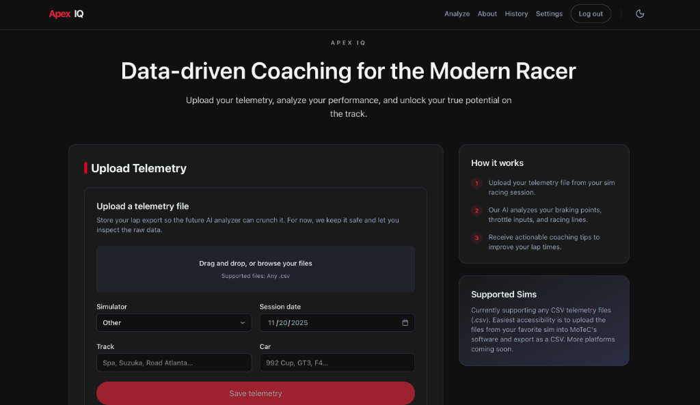
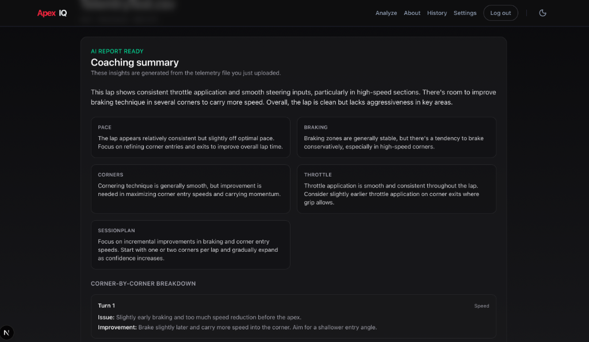
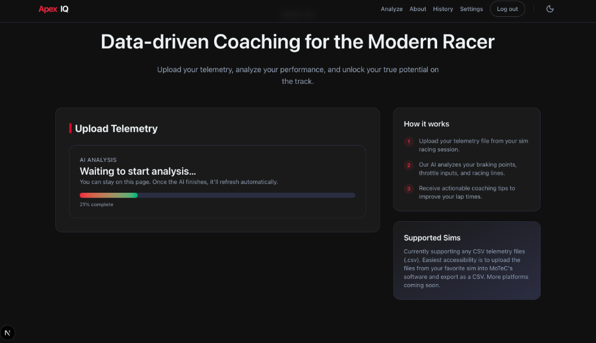
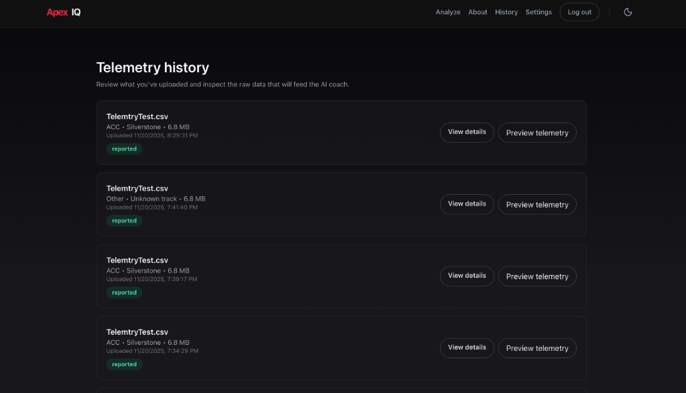
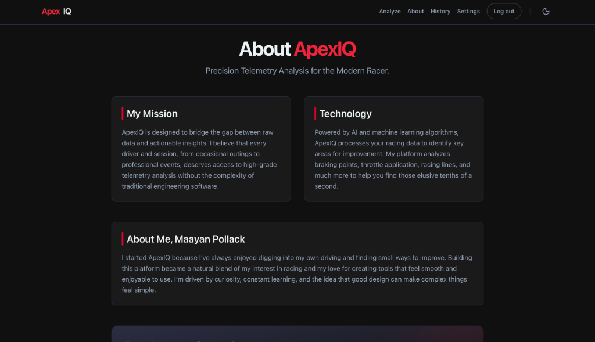

# ApexIQ

**ApexIQ** is an advanced racing telemetry analysis platform that leverages AI to provide deep insights into racing performance. Upload your telemetry data, visualize key metrics, and receive intelligent recommendations powered by Google's Gemini AI to optimize your racing strategy.


---

## 📸 Visual Showcase

### Homepage & Upload


### AI-Powered Analysis


### Real-time Processing


### Session Management


### About


---

## 🏁 Features

- **📊 Telemetry Upload & Processing**: Upload racing telemetry files (CSV format) for comprehensive analysis
- **🤖 AI-Powered Insights**: Get intelligent performance analysis and recommendations via Google Gemini AI
- **📈 Interactive Visualizations**: Explore your data through intuitive charts and graphs
- **🔐 Secure Authentication**: Built-in user authentication powered by Supabase
- **🌓 Light/Dark Mode**: Seamless theme switching for optimal viewing experience
- **📱 Responsive Design**: Modern, racing-inspired UI that works across all devices
- **⚡ Real-time Processing**: Track upload and processing status with live feedback

---

## 🛠️ Tech Stack

### Frontend
- **[Next.js 16](https://nextjs.org/)** - React framework with App Router
- **[React 19](https://react.dev/)** - Latest React with concurrent features
- **[TypeScript](https://www.typescriptlang.org/)** - Type-safe development
- **[Tailwind CSS 4](https://tailwindcss.com/)** - Utility-first styling
- **[next-themes](https://github.com/pacocoursey/next-themes)** - Theme management
- **[Lucide React](https://lucide.dev/)** - Modern icon library

### Backend & Services
- **[Supabase](https://supabase.com/)** - Authentication, database, and storage
- **[Google Gemini AI](https://ai.google.dev/)** - AI-powered telemetry analysis
- **[Next.js API Routes](https://nextjs.org/docs/app/building-your-application/routing/route-handlers)** - Serverless API endpoints

### Development Tools
- **ESLint** - Code quality and consistency
- **Babel React Compiler** - Optimized React builds
- **pnpm** - Fast, disk-efficient package manager

---

## 🎨 Design Journey

### The Evolution

ApexIQ evolved through **47+ commits** over several months, transforming from a simple landing page concept into a full-featured AI-powered telemetry platform. This journey represents not just technical growth, but a deep exploration of what it means to make complex data accessible.

### Design Process

#### **Phase 1: Foundation (v0.1.0 - v0.2.1)**
Started with the core question: *"How do I make professional-grade telemetry analysis accessible to everyday racers?"*

**Initial decisions:**
- Chose **Next.js App Router** for its modern file-based routing and server components
- Implemented **Supabase** for rapid authentication and database setup
- Built a minimal landing page to validate the concept

**Key learning:** The importance of database schema design early. Initial migrations set the foundation for user uploads, telemetry storage, and analysis results.

#### **Phase 2: Core Functionality (v0.2.2 - v0.4.2)**
This phase focused on getting the fundamental upload-to-analysis flow working.

**Major milestones:**
- **File Upload System** - Struggled with Supabase storage key errors, learned the importance of proper bucket policies and path handling
- **Worker Architecture** - Built an asynchronous job processing system using GitHub Actions cron jobs to handle AI analysis without blocking the UI
- **Real-time Status Tracking** - Created a polling mechanism so users could see their uploads progress from "pending" → "processing" → "reported"

**Technical decision:** Chose a queue-based approach over serverless functions for AI processing to avoid timeout issues with large telemetry files.

**Challenge overcome:** Fixed async/await issues in dynamic route params that caused upload ID resolution failures.

#### **Phase 3: AI Integration (v0.5.0 - v0.5.5)**
The most challenging phase—integrating Google's Gemini AI for intelligent analysis.

**Iterations:**
1. **First attempt:** Hit rate limiting (429 errors) due to improper request handling
2. **Second iteration:** Successfully called Gemini API but struggled with structured output parsing
3. **Final implementation:** Designed a comprehensive prompt that returns analyzable JSON with session summaries, key metrics, and actionable coaching advice

**Key learning:** AI integration isn't just about API calls—it's about prompt engineering, error handling for incomplete data, and designing UI that gracefully handles partial or failed analyses.

**Design choice:** When Gemini returns incomplete data, show what we *can* display and provide clear messaging for missing sections, rather than failing the entire report.

#### **Phase 4: UI Modernization (v0.6.0)**
Recent major overhaul to transform the interface into a polished, production-ready experience.

**Changes:**
- Implemented **racing-inspired color scheme** (racing red accents, carbon black gradients)
- Added **light/dark mode** with `next-themes` for accessibility
- Created **About page** to tell the story behind the platform
- Built **Settings page** with theme toggle
- Enhanced all forms and cards with consistent design language
- Fixed hydration issues and graphical bugs

**Design philosophy:** Every interface should feel fast, clean, and purpose-built. Avoided generic blue buttons and default fonts—chose gradient accents and racing aesthetics that match the domain.

### Technical Decisions

#### **Why Next.js 16?**
- Server components reduce client-side JavaScript
- Built-in API routes simplify backend logic
- App Router provides cleaner routing than Pages Router

#### **Why Supabase over custom backend?**
- Rapid authentication without building auth flows from scratch
- PostgreSQL gives flexibility for complex queries
- Storage buckets handle file uploads cleanly

#### **Why Gemini over other AI providers?**
- Structured output support for reliable JSON parsing
- Cost-effective for prototype/beta
- Strong performance on analytical tasks

#### **Why queue-based processing?**
- Telemetry files can be large (thousands of rows)
- AI analysis can take 30-60 seconds
- Decoupling upload from analysis prevents timeout errors

### What I Learned

1. **Error handling is 50% of the product** - More time went into handling edge cases (missing telemetry fields, API failures, incomplete uploads) than the happy path.

2. **Progressive enhancement matters** - The app works without JavaScript for the upload form, degrades gracefully when AI fails, and provides loading states for every async operation.

3. **Design consistency compounds** - Small decisions (border radius, color palette, spacing system) made early pay dividends when building new pages later.

4. **Real-world testing reveals assumptions** - The "stuck at 90%" upload bug only appeared with certain CSV formats. Testing with diverse data sources is critical.

5. **AI is a tool, not magic** - Gemini doesn't "just work"—it requires careful prompting, output validation, retry logic, and fallback strategies.

6. **Semantic versioning tells a story** - Looking back at version bumps (0.1 → 0.6) shows clear milestones: foundation, features, AI, polish.

---

## 🚀 Getting Started

### Prerequisites

- **Node.js** 18.x or higher
- **pnpm** (recommended) or npm
- **Supabase account** for backend services
- **Google AI API key** for Gemini integration

### Installation

1. **Clone the repository**
   ```bash
   git clone <repository-url>
   cd ApexIQ
   ```

2. **Install dependencies**
   ```bash
   pnpm install
   ```

3. **Set up environment variables**
   
   Copy the example environment file:
   ```bash
   cp .env.example .env.local
   ```
   
   Configure the following variables in `.env.local`:
   ```bash
   # Supabase Configuration
   NEXT_PUBLIC_SUPABASE_URL=your_supabase_url
   NEXT_PUBLIC_SUPABASE_ANON_KEY=your_supabase_anon_key
   
   # Google AI Configuration
   GEMINI_API_KEY=your_google_ai_api_key
   
   # Application URL
   NEXT_PUBLIC_APP_URL=http://localhost:3000
   ```

4. **Set up Supabase**
   
   Run the Supabase migrations to set up your database schema:
   ```bash
   pnpm supabase db push
   ```

5. **Start the development server**
   ```bash
   pnpm dev
   ```

6. **Open your browser**
   
   Navigate to [http://localhost:3000](http://localhost:3000)

---

## 📖 Usage

### Uploading Telemetry Data

1. Navigate to the **Telemetry Upload** page
2. Select your telemetry CSV file (must include standard racing telemetry fields)
3. Fill in the required metadata (track name, session type, etc.)
4. Click **Upload** and wait for processing to complete
5. View your detailed analysis and AI-generated insights

### Viewing Analysis

- Access your uploaded sessions from the **Dashboard**
- Click on any session to view detailed metrics and visualizations
- Review AI-generated recommendations for performance improvements
- Export reports or share insights with your team

---

## 🏗️ Project Structure

```
ApexIQ/
├── src/
│   ├── app/              # Next.js App Router pages
│   ├── components/       # React components
│   │   └── telemetry/   # Telemetry-specific components
│   ├── lib/             # Utility functions and configurations
│   └── static/          # Static assets
├── public/              # Public assets
├── supabase/            # Supabase configuration and migrations
└── package.json         # Project dependencies
```

---

## 🚢 Deployment

### Deploy to Vercel (Recommended)

1. **Connect your repository** to [Vercel](https://vercel.com)
2. **Configure environment variables** in the Vercel dashboard
3. **Deploy** - Vercel will automatically build and deploy your application

### Environment Variables for Production

Ensure the following environment variables are set in your production environment:
- `NEXT_PUBLIC_SUPABASE_URL`
- `NEXT_PUBLIC_SUPABASE_ANON_KEY`
- `GEMINI_API_KEY`
- `NEXT_PUBLIC_APP_URL`

### Build Command

```bash
pnpm build
```

### Start Production Server

```bash
pnpm start
```

---

## 🧪 Development

### Available Scripts

- `pnpm dev` - Start development server
- `pnpm build` - Build for production
- `pnpm start` - Start production server
- `pnpm lint` - Run ESLint

### Code Quality

This project uses ESLint for code quality and the React Compiler for optimizations. Run linting before committing:

```bash
pnpm lint
```

---

## 🤝 Contributing

This is a private project. For questions or issues, please contact the developer.

---

## 📄 License

This project is private and proprietary. All rights reserved.

---

## 🆘 Support

For support, bug reports, or feature requests, please contact the developer or create an issue in the project repository.

---

**Built with ❤️ for racing enthusiasts**
